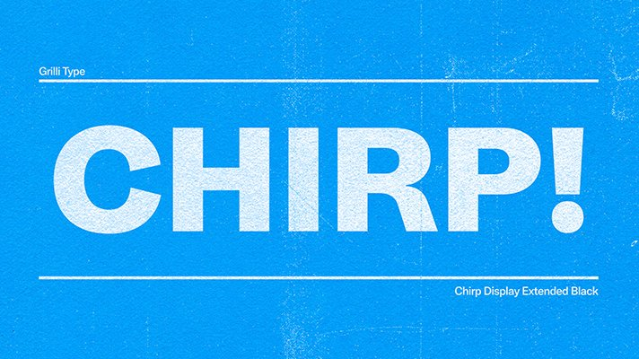

# Chirp Font

X's (formerly known as Twitter) Chirp font is available as a `.woff` font for web use. In this repo, you can find `.otf` and `.ttf` conversions for desktop/workstation use. All converted fonts have been fixed to be properly named. Conversions done with [fonttools](https://github.com/fonttools/fonttools).

### Fonts available:

* Chirp Regular
* Chirp Bold
* Chirp Medium
* Chirp Heavy

### Original fonts downloaded from:

* https://abs.twimg.com/fonts/chirp-regular-web.woff
* https://abs.twimg.com/fonts/chirp-bold-web.woff
* https://abs.twimg.com/fonts/chirp-medium-web.woff
* https://abs.twimg.com/fonts/chirp-heavy-web.woff

### Read more from X's design team:

* https://x.com/XDesign/status/1425505308563099650
